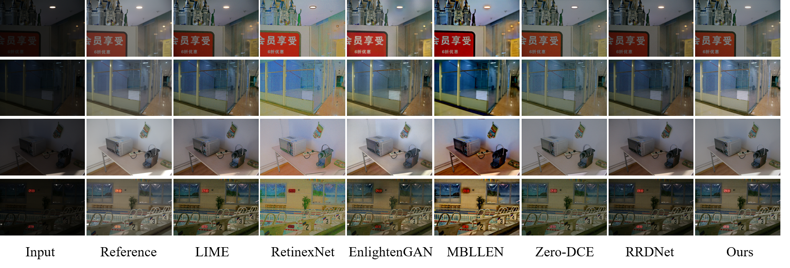
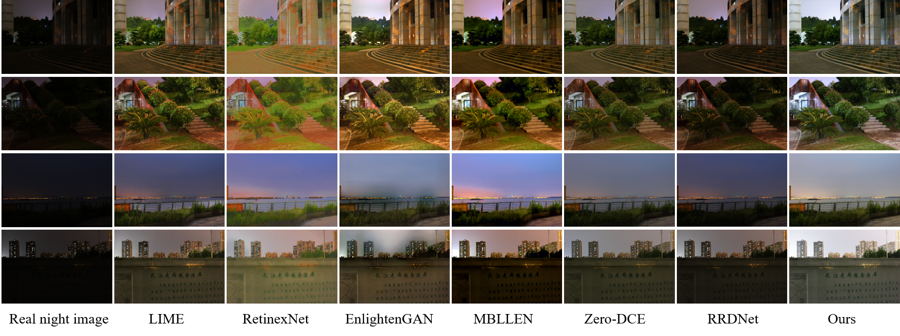

# Zero-shot-dual-iter-LLE
The code of Zero-shot learning for low-light image enhancement based on dual iteration.
You can get the real night image testset in [7qm8](https://pan.baidu.com/s/1PuvJymsRCOzPWDSck9hCcg)
- Python 3.7
- Tensorflow >= 2.0
- numpy
## Zero-shot pipeline
'''
python zero_shot.py
'''
# Some of the comparisons are as follows

